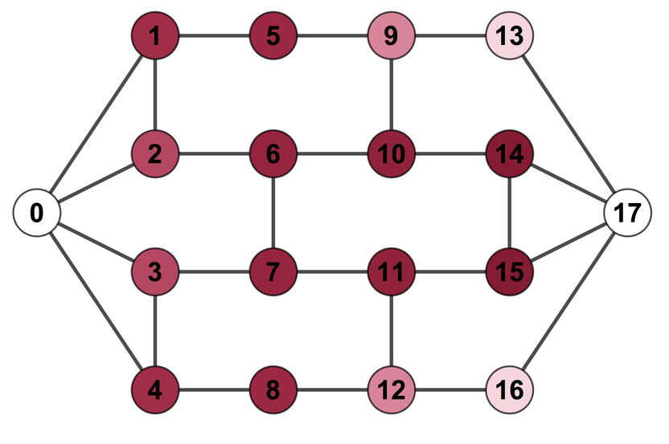
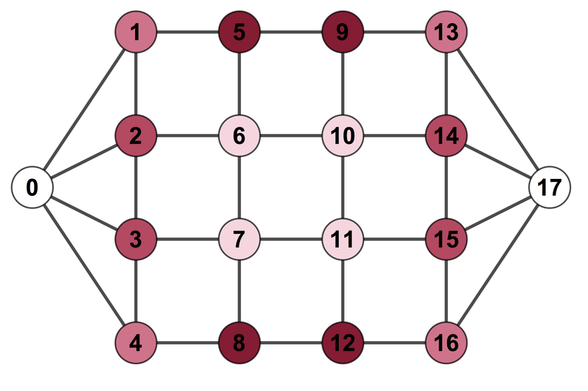
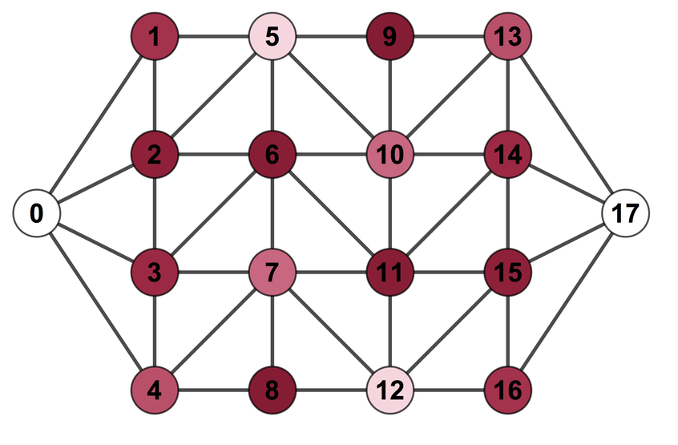
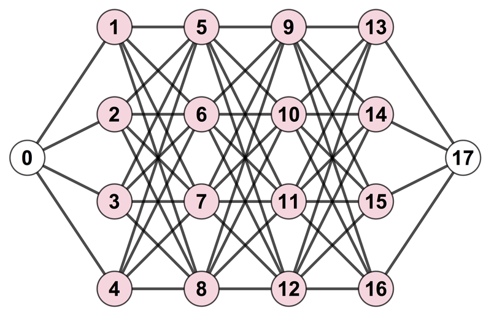
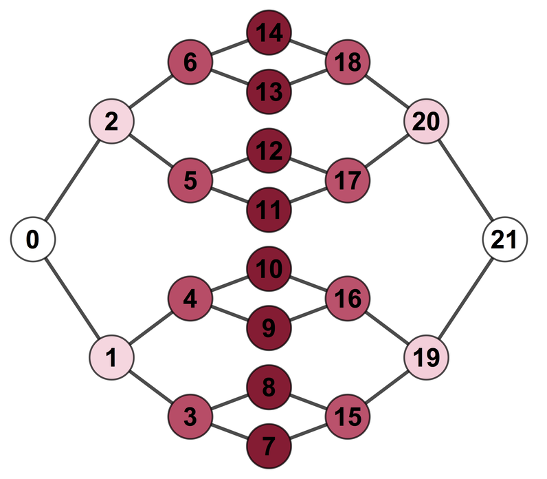

# Stabilizer Pathfinding

*by Sam Morley-Short*

---

Stabilizer Pathfinding (SPF) is a general technique for achieving maximally loss-tolerant teleportation on quantum stabilizer states.
Specifically, SPF finds sequences of single-qubit measurement patterns that teleportation some input qubit to some other output qubit on a stabilizer state.
Because any qubit not included in such a measurement pattern can be freely discarded without affecting teleportation, maximal loss tolerance is thus achieved by finding measurement patterns with minimum weight.

For further details on SPF and the degree of loss-tolerant teleportation it allows, see the arXiv pre-print [Loss-tolerant teleportation on large stabilizer states](https://arxiv.org/abs/1807.08729).

This repository is provided both in support of the above work and as a tool for use in near-future experimental implementations of loss-tolerant teleportation. All code within this repository is free to use and released without warranty under the GNU General Public License v3.0.

## Directory overview

The directory is structured as follows, containing the subdirectories:

* **channels**: Defines the central `Channel` class that implements our SPF algorithm as well as a number of subclasses for readymade graph-state channels.
* **utils**: Provides general utility functions used in many scripts within the directories, such as defining the Pauli algebra.
* **analysis**: Scripts for analysing the loss-tolerance of channels and generating numerical simulation datasets.
* **figures**: Plotting functions for the reproduction of all figures presented in the paper.
* **tests**: Unit test that ensure SPF is working correctly.
* **docs**: Any supporting documentation, such as on  setting up of CUDA for GPU processing.

All scripts within the directory are written in Python version 2.7 and require the following packages to be installed (with a confirmed working version number):

* numpy (1.14.3)
* matplotlib (2.2.2)
* pandas (0.22.0)
* tqdm (4.19.5)
* scipy (1.0.1)
* networkx (2.1)
* numba (0.37.0+0.gb6b965a.dirty)

## How to use this directory

Contents:

* [The Channel class](#Channel_class)
* [Readymade channels](#readymade_channels)
* [Simulation and analysis](#channel_analysis)
* [Unit testing](#testing)

<a name="Channel_class"></a>
### The Channel class

The core of the stabilizer pathfinding algorithm is implemented in the `Channel` class defined in `channels/channel.py`. From the root directory, this can be imported using

```python
from channels.channel import Channel
```

This class represents a quantum channel produced by Clifford operations applied to some initial arbitrary qubit. In normal use the channel is initialised as a single arbitrary qubit labeled by the keyword argument `source` (with default value `0`).

For example, a single arbitrary qubit `q` is initialised by:

```python
psi = Channel(source='q')
```

A human-readable output of the channel's logical operators and stabilizer generators can be displayed using the standard `print` function. For example, in our case `print psi` returns

```
X: +1 X
Z: +1 Z
S: +1 _
Q: ph q
```

depicting the logical X and Z operators and the state's stabilizer generators (where `_` represents the identity). Note that an unenforced generator (from which a logical state can be defined) is included as a placeholder.

The standard operations outlined by Gottesman-Knill theorem (qubit creation, Clifford gate evolution and Pauli measurement) can then be applied to build the desired stabilizer state. For example, unitialised qubits (with custom labels) can be added by

```python
psi.add_qubit('ur')
psi.add_qubits(['ao','nc'])
```

or graph-state superposition qubits or *nodes* by

```python
psi.add_node('tk')
psi.add_nodes(['us','m'])
``` 

The single-qubit quantum operations Hadamard (H), phase gate (S) and bitflip (X) can be applied using

```python
psi.act_gate('q', 'H')
psi.act_gates([('ao', 'S'), ('nc', 'X')])
```

or equivalently through the shorthand functions

```python
psi.act_hadamard('tk')
psi.act_phase_gate('us')
psi.act_bitflip('m')
```

and their associated multi-qubit versions, such as

```python
psi.act_hadamards(['ur','ao','nc','tk','us'])
``` 

Two-qubit controlled-Z (CZ) gates can then be applied to create entanglement on states

```python
psi.act_CZ('q','ur')
psi.act_CZs([('q', 'ao'), ('ur', 'nc'), ('ur', 'tk'), ('ao', 'nc'), 
			 ('ao', 'tk'), ('nc', 'm'), ('tk', 'm'), ('us', 'm')])
```

Having applied the above operations to `psi`, we have the prepared the state 

```
X: +1 Z _ _ _ _ _ _
Z: +1 X Z Z _ _ _ _
S: +1 _ _ _ _ _ _ _,
   +1 Z X _ Z Z _ _,
   +1 Z _ X Z Z _ _,
   -1 _ Z Z X _ _ Z,
   +1 _ Z Z _ X _ Z,
   -1 _ _ _ _ _ Y Z,
   +1 _ _ _ Z Z Z X
Q: ph q u a n t u m
        r o c k s
``` 

(Note that qubit names are displayed vertically.)

Once the desired channel has been constructed, it can be used to find valid loss-tolerant measurement patterns for teleportation.

Firstly, qubit loss can be added to qubits in the channel

```python
psi.lose_qubit('ur') 
```

where keyword option `heralded=False` can used in the case of unheralded loss (and multiple qubits lost using `psi.lose_qubits(qubits)`).

Secondly, teleportation's output qubit(s) must be defined. These are the qubits on which logical operator must exist (i.e. anticommute) on after teleportation. In our case, let this be the qubit `m`.

```python
psi.update_inputs_and_outputs(outputs=['m'])
```

Measurement patterns that recover the logical state on the output qubit(s) can then be found using

```python
mnt_patterns, qubit_key = psi.get_mnt_patterns()
```

where `mnt_patterns` is a dictionary containing lists of valid measurement patterns grouped and keyed by weight, with individual patterns indexed by `qubit_key`. In our case we find the following measurement patterns with qubit key `['q', 'ao', 'nc', 'tk', 'us']` (note: the lost qubit `ur` has been omitted).

```
{4: [[1, 1, 1, 0, 1],
     [1, 1, 0, 1, 1],
     [2, 1, 1, 0, 1],
     [2, 1, 0, 1, 1],
     [2, 1, 1, 0, 3],
     [2, 1, 0, 1, 3],
     [1, 1, 1, 0, 3],
     [1, 1, 0, 1, 3]],
 5: [[2, 1, 2, 3, 1],
     [2, 1, 3, 2, 1],
     [1, 1, 3, 2, 1],
     [1, 1, 2, 3, 1],
     [1, 1, 2, 3, 3],
     [1, 1, 3, 2, 3],
     [2, 1, 2, 3, 3],
     [2, 1, 3, 2, 3]]}
```

where values 0, 1, 2, and 3 represent Pauli bases I, X, Y, and Z respectively (where an identity operator indicates the qubit need not be measurement). Note that `mnt_patterns` will be an empty dictionary if teleportation is not possible.

Finally, to verify a returned pattern we can simply perform the measurements

```python
# Creates a list of non-identity measurements in form (qubit, basis) from the first weight-4 pattern
mnts = [(q, b) for q, b in zip(qubit_key, mnt_patterns[4][0]) if b != 0]
# Gets the first measurement in the list
qubit, basis = mnts.pop()
# Applies measurements
psi.pauli_measurement(qubit, basis)
psi.pauli_measurements(mnts)
```

(Note: it is assumed that the required corrective operators are applied on a -1 eigenvalue outcome).

After measurement the channel is in the state

```
X: +1 _ _ Y
Z: -1 _ _ Z
S: +1 _ _ _,
   +1 X _ _,
   -1 _ X _
Q: ph u t m
      r k
```

where can see that the original qubit state now exists solely on qubit `m` up to some local unitary. In our case, the original state is recovered by applying the gates

```python
psi.act_bitflip('m')
psi.act_phase_gate('m')
```

Since the remaining qubits in the state are completely disentangled from one another, they can be freely discarded or *forgetten* using

```python
psi.forget_qubits(['ur', 'tk'])
```

(with `psi.forget_qubit(qubit)` used to forget individual qubits). Note that this operation cannot be applied to any qubit entangled to another. 

Lastly, we can print `psi` to verify that the original state initialised on qubit `q` has been recovered on qubit `m`, thus completing the teleportation protocol.

```
X: +1 X
Z: +1 Z
S: +1 _
Q: ph m
```

The unabridged code for the above protocol is found below in this the comments of this README.

<!--
from channels.channel import Channel
psi = Channel(source='q')
print psi
psi.add_qubit('ur')
psi.add_qubits(['ao','nc'])
psi.add_node('tk')
psi.add_nodes(['us','m'])
psi.act_gate('q', 'H')
psi.act_gates([('ao', 'S'), ('nc', 'X')])
psi.act_hadamard('tk')
psi.act_phase_gate('us')
psi.act_bitflip('m')
psi.act_hadamards(['ur','ao','nc','tk','us'])
psi.act_CZ('q','ur')
psi.act_CZs([('q', 'ao'), ('ur', 'nc'), ('ur', 'tk'), ('ao', 'nc'), ('ao', 'tk'), ('nc', 'm'), ('tk', 'm'), ('us', 'm')])
print psi
psi.lose_qubit('ur')
psi.update_inputs_and_outputs(outputs=['m'])
mnt_patterns, qubit_key = psi.get_mnt_patterns()
# Makes list of measurement elements in form (qubit, basis) and removes 
mnts = [(q, b) for q, b in zip(qubit_key, mnt_patterns[4][0]) if b != 0]
qubit, basis = mnts.pop() # Get the first measurement in the list
psi.pauli_measurement(qubit, basis)
psi.pauli_measurements(mnts)
print psi
psi.act_bitflip('m')
psi.act_phase_gate('m')
psi.forget_qubits(['ur', 'tk'])
print psi
-->

#### Other `Channel` functionalities

There are a number of additional options for a `Channel` object not included above:

* **Exporting and importing `Channel` instances**:

	To export a prepared channel, the class method `export_channel_to_file(filename)` is provided with `filename` the name of some `.json` file, such as `psi.export_channel_to_file('psi.json')`.
	
	To import a previously exported channel, the `filename` keyword is supplied to `Channel` during instantiation, such as `psi = Channel(filename='psi.json')`.

* **`act_CZ(s)` keyword options**:

	The `Channel` class methods `act_CZ(s)` have two optional arguments: `prob` and `checkpoints`.
	
	To allow for probabilistic entangling gates, `prob` defines the probability with which `act_CZ(s)` is applied (with default value 1).
	
	For larger states, applying `act_CZ(s)` may take some time. To ensure any progress is not lost, a filename prefix is supplied to `checkpoints` for exporting the channel after the completion of each CZ. For example, 
	
	```python
	psi.act_czs([('a', 'b'), (0, 1)], checkpoints='psi_chkpt')
	```
	
	will output files `psi_chkpt_0-1.json` and `psi_chkpt_a-b.json`, each encoding an importable `Channel` object.
	
* **`update_inputs_and_outputs` keyword options**:

	The `Channel` class method `update_inputs_and_outputs` has three optional arguments: `inputs`, `outputs`, and `join`.
	
	If executed without any arguments `psi.update_inputs_and_outputs()` leaves `psi.outputs` unchanged and defines `psi.inputs` as the set of non-output qubits.
	If a set of input and output qubits are provided (or have been previously defined), setting `join=True` untracks any stabilizers that do not have non-trivial support on at least one qubit from both the input and output sets.
	This option is provided as a pre-processing step which may be applied prior to `get_mnt_patterns` to remove irrelevant stabilizers, thus reducing the function's runtime on very large states.
	However, given that removing any stabilizers will prevent SPF from working on future evolution, by default `join` is set to `False`.
	
* **`get_mnt_patterns` keyword options**:

	The `Channel` class methods `get_mnt_patterns` has two optional arguments: `max_weight`, and `rel_weight`.
	
	The arguments `max_weight` and `rel_weight` define the depth of search performed for valid measurement patterns.
	Here `max_weight` defines the maximum weight of the logical operators paired to produce measurement patterns.
	If `rel_weight=True` (read *relative weight*), then `max_weight` is the maximum weight above the minimum logical operator weight, whereas else if `rel_weight=False`, then `max_weight` is the absolute value provided by `max_weight`.
	By default, `max_weight` is set to the total number of qubits in the channel and `rel_weight=True`.

* **Verbosity**: 

	The `_verbose` class method is provided as a decorator for other class methods, printing the channel before and after a method is applied. By default, `@_verbose` only decorates `act_CZ(s)` and `pauli_measurement(s)`, however it can be applied to any method for debugging purposes. For example, if `@_verbose` is inserted above the `add_qubit` method definition, then
		
	```python
	psi = Channel()
	psi.add_qubit(1)
	```
	
	produces the output
	
	```
	Before add_qubit(qubit=1, prob_loss=0):
	X: +1 X
	Z: +1 Z
	S: +1 _
	Q: ph 0 
	
	After add_qubit(qubit=1, prob_loss=0):
	X: +1 X _
	Z: +1 Z _
	S: +1 _ _,
	   +1 _ Z
	Q: ph 0 1 
	```
	
	To prevent output, simply remove or comment out any `@_verbose` decorators.
	
* **Testing**:

	For debugging purposes, the `_test` class method is also provided as a decorator for other class methods, applying a suite of tests to the channel after the method's completion.
	Specifically, it tests: a) whether all tracked stabilizers are correct (w.r.t their generator combination description), which also ensures no stabilizers are duplicated; and b) whether all non-trivial stabilizers have been found and all trivial stabilizers ignored.
	Note: because the decorator has optional arguments, it must be applied with parentheses, e.g. `@_test()`.
	
	For example, consider the construction of a fully-connected 5-qubit graph-state channel:
	
	```python
	psi = Channel()
	psi.act_hadamard(0)
	psi.add_nodes([1, 2, 3, 4])
	psi.act_CZs([(i, j) for i in range(5) for j in range(i) if i != j])
	```
	
	With both `@_verbose` and `@_test()` applied, the following output is returned for the final CZ
	
	```
		Before act_CZ(u=4, v=3, prob=1, checkpoints=False):
	X: +1 Z _ _ _ _
	Z: +1 X Z Z Z Z
	S: +1 _ _ _ _ _,
	   +1 Z X Z Z Z,
	   +1 Z Z X Z Z,
	   +1 Z Z Z X _,
	   +1 Z Z Z _ X
	Q: ph 0 1 2 3 4 
	
	
	Testing all combo stabs correct...
	Testing all non-trivial combos found...
	15 non-trivial combos possible
	15 non-trivial combos tracked
	Tests complete
	
	After act_CZ(u=4, v=3, prob=1, checkpoints=False):
	X: +1 Z _ _ _ _
	Z: +1 X Z Z Z Z
	S: +1 _ _ _ _ _,
	   +1 Z X Z Z Z,
	   +1 Z Z X Z Z,
	   +1 Z Z Z X Z,
	   +1 Z Z Z Z X
	Q: ph 0 1 2 3 4 
	```
	
	thus confirming `Channel` has functioned correctly. 
	
	The `_test` decorator can also take the following arguments: `print_stabs`, `join`, and `exit`.
	If `print_stabs=True`, any stabilizers that are *overtracked* (tracked but trivial) or *undertracked* (untracked but non-trivial) are printed in human readable format.
	By default `print_stabs=False`.
	The `join` argument is provided to ensure tests are consistent with any stabilizers discarded by `update_inputs_and_outputs`, such that if `join=True`, tests only consider stabilizers joining input to output qubits.
	By default `join=False`.
	Finally, `exit` allows the user to choose whether the program exits after the failure of any tests.
	By default, `exit=True`.
 
* **GPU operation**:

	For the extension of SPF to very large states, the option to leverage highly-parallel GPUs is provided.
	This option is set during channel instantiation via the `use_gpu` keyword argument, such as `psi = Channel(use_gpu=True)`.
	
	To leverage the GPU, Python uses the `numba` package submodules `cuda` and `jit` and requires NVIDIA's CUDA to be installed.
	Given that correctly installing CUDA can be somewhat involved and system-specific, we do not provide installation instructions here and refer the reader to NVIDIA's online documentation.
	However, for Mac users wishing to install CUDA on OS X High Sierra (especially those running older machines), some documentation is provided in `docs/CUDA_README.md`, including some commonly encountered problems and their solutions.

<a name="readymade_channels"></a>
### Readymade channels

A number of readymade channels are provided in the `/channels` directory.

#### Lattice channels

The lattice channels `HexagonalLatticeChannel`, `SquareLatticeChannel` and `TriangularLatticeChannel` are implemented as subclasses of the `Channel` class.
These classes instead take the arguments `width`, `length` at initialisation, defining the dimensions of the state to be constructed.
In addition to the qubits within the lattice, *virtual* input and output qubit are entangled with all the qubits of the first and last vertical layer and are respectively used to represent any preparation and readout of logical states.

All three subclasses also take the following optional arguments:

* `prob_edge`: the probability with which CZs are applied. Can be used to create percolated lattice states. Default value is 1.
* `prob_loss`: the per-qubit loss probability. Default value is 0.
* `output_node`: whether or not a virtual output qubit is added. Default value is `True`.
* `checkpoints`: the file prefix used for any post-CZ checkpoint exports when not. Default value is `None`.
* `use_gpu`: whether or not to use GPU processing to create the channel. Default value is `False`. 

Lastly, `TriangularLatticeChannel` also has the optional argument `alt_diag` which determines the directionality of diagonal edges. By default it is set to `True` such that diagonal edges slant in alternate directions between adjacent columns of qubits.

If a lattice channel is constructed with `output_node=False`, the `add_layer` class method can be used to add additional layers onto the lattice. 
Once the desired channel length is reached the `add_output_node` method can be used to apply a virtual output qubit. 

Graph representations of 4 x 4 instances of `HexagonalLatticeChannel`, `SquareLatticeChannel` and `TriangularLatticeChannel` are respectively depicted below: 



where darker nodes indicate a greater loss-tolerance.

#### Linear crazy graph channels

Linear crazy graph channels (i.e. loss-tolerant encodings of linear cluster states) are implemented by the `CrazyGraphChannel` subclass.
These channels are similarly instantiated with a `width` and `length` and have the same optional arguments and class methods as the lattice channels described above.

The graph representation of the 4 x 4 `CrazyGraphChannel` is depicted below: 



#### Tree-to-tree channels

Tree-to-tree channels are implemented in the `TreeToTreeChannel` subclass.
These channels are instantiated with a `branches` and `depth` variable that represent the number of branches per tree node and the number of tree layers in each side of the channel.
The optional arguments `prob_loss`, `checkpoints`, and `use_gpu` can also be supplied, with the same definitions and default values as described above.

The graph representation of the two-branch, depth-three `TreeToTreeChannel` is depicted below:



#### (Random) Graphs

A selection of random graph channel subclasses are also provided.

For constructing general graph-state channels, the `GraphChannel` subclass is defined, taking the arguments `nodes` and `edges` at initialisation.
From these the appropriate graph state is constructed with the input qubit taken as the first element of `nodes`.
Output qubits are defined using the optional argument `output`.
The subclass also takes optional argument `prob_loss` and `use_gpu` as described above.

Both G(n,p) and G(n,m) Erdos-Renyi random graph-state channels are implemented `RandomGNPGraphChannel` and `RandomGNMGraphChannel` repsectively.
G(n,p) describes the set of random n-node graphs where each possible edge is created with probability p, whereas G(n,m) is the set of random n-node graphs with m edges.
In both case the resultant graph-states are always connected (and hence n-1 <= m <= n(n - 1)/2).
As such, `RandomGNPGraphChannel` and `RandomGNMGraphChannel` are instantiated with the `nodes` argument and `prob_edge` or `n_edges` respectively.
Note that `nodes` can be either by a list of node labels or an integer number of nodes (in which case nodes are numbered from 0 to n-1).
Both subclasses also take the optional arguments `output`, `prob_loss` and `use_gpu` as described above.

<a name="channel_analysis"></a>
### Simulation, analysis and figures

#### Channels' loss tolerances

The functions `build_channel` and `analyse_channel` are provided in `/analysis/channel_analysis.py` and implement a suite of analyses to provide data on channels' loss tolerance.
Firstly, `build_channel` simply constructs the desired channel and outputs it to file.
It takes the arguments:

* `channel`: the channel (sub)class being simulated.
* `channel_kwargs`: a dictionary of keyworded arguments specifying the channel's instantiation.
* `output`: the output qubit for teleportation. 
* `prefix`: the filename prefix used for the simulation output.
* `test` (optional): If `True`, applies tests to channel after construction. Default value is `False`.

For the purpose of graph pathfinding (GPF), single input and output qubits need to be defined.
Hence, it is assumed that the input channel has some graph representation (stored in the `channel.edges` class variable).
We therefore assume that teleportation occurs from one input qubit to one output qubit, and in the case where multiple inputs and/or outputs are desired, virtual qubits should be used.

Secondly, `analyse_channel` takes the data produced by `build_channel` and performs a series of loss tolerance analyses as defined by the following arguments:

* `prefix`: the filename prefix of the data to read in. Should be the same as above.
* `i` and `o`: the input qubit and output qubit used for GPF teleportation. `o` should be the same as `output` above. (Note: `input` is a Python function and so cannot be used as a variable name.)
* `max_weight`: the maximum weight of logical operators combined to find measurement patterns.
* `rel_weights`: whether the maximum logical operator weight is relative to the minimum logical operator weight or not.
* `verbose` (optional): If `True`, data generated is printed live. This can be particularly useful in case of code crashing before it has been output to file. Default value is `False`. 
* `workers` (optional): Number of CPU workers to use for parallel Monte Carlo simulations. Default value is 1.
* `mc_reps` (optional): Number of repetitions used during teleportation Monte Carlo simulation. Default value is 1000.

When executed, `analyse_channel` finds:

* **Configurations of qubit loss a channel is loss tolerant to using SPF.** 
The files with suffixes `_MWx_LOSS_TOL_RAW.json` and `_MWx_SPF_LOSS_TOL_ALL.json` contain a list of the largest sets of qubits that can be lost by any measurement pattern and the subsequent list of all possible subsets of loss tolerances respectively.
The file with suffix `_MWx_SPF_CONFIG_TOL.csv` also contains a table of the total number and proportion of n-qubit loss configurations SPF can tolerate over a range of n.
* **Configurations of qubit loss channel is loss tolerant to using GPF.**
The file with suffix `_GPF_LOSS_TOL_ALL.json` contains a list of all the possible sets of qubits whose loss can be tolerated by GPF.
The file with suffix `_GPF_CONFIG_TOL.csv` also contains a table of the total number and proportion of n-qubit loss configurations GPF can tolerate over a range of n.
* **Per-node loss tolerances.** 
The file with suffix `_MWx_SPF_PER_NODE_TOL.csv` contains a table listing the number of measurement patterns that do not contain each qubit.
* **SPF teleportation rate against per-qubit loss probability.**
The file with suffix `_MWx_yMC_SPF_TEL_RATE.csv` provides a table containing the rate and standard error for SPF teleportation across the channel for heralded loss probabilities between 0 and 1.
* **GPF teleportation rate against per-qubit loss probability.**
The file with suffix `_yMC_GPF_TEL_RATE.csv` similarly provides a table containing the rate and standard error for GPF teleportation across the channel for heralded loss probabilities between 0 and 1.
* **SPF unheralded loss tolerance against per-qubit loss probability.**
The file with suffix `_MWx_yMC_SPF_UH_MT_TEL_RATE.csv` provides a table of the rate and standard error of teleportation using SPF for unheralded loss probabilities between 0 and 1.
Here the unheralded loss teleportation strategy used is known as *max-tolerance*, as indicated by the `UH_MT` label.

In all of the above suffixes `x` denotes the maximum weight with which the measurement patterns were found and `y` the number of Monte Carlo repetitions performed.

For example, the following code will build and analyse the 3 x 3 square lattice graph-state channel:

```python
# Defines simulation constants
verbose, test, use_gpu = False, False, False
mc_reps, workers = 1000, 1
max_weight, rel_weights = 5, True

# Defines channel to anaylse
channel = SquareLatticeChannel
width, length = 3, 3
channel_kwargs = {'width': width, 'length': length, 'use_gpu': use_gpu}
i, o = 0, width * length + 1
prefix = 'W%dxL%d_SqLatChannel_test' % (width, length)

# Builds channel and performs analysis
build_channel(channel, channel_kwargs, o, prefix, test=test)
analyse_channel(prefix, i, o, max_weight, rel_weights, verbose=verbose, workers=workers, mc_reps=mc_reps)
```

#### Figures

All numerical figures in the paper can be reproduced by executing the scripts found in `/figures`.
The data needed for these can either be accessed by unzipping `/analysis/data.zip` in the `with-data` branch of this repository or generated locally by running the script `generate_figure_data.py` found in `/analysis`.

<a name="testing"></a>
### Unit tests

A small suite of tests are implemented in the `/tests` directory using the `unittest` framework.
Currently, the scope of these tests is limited to high-level functionality of the `Channel` class, such as their construction and use in teleportation.
The tests can be run either using `nose` or by running `python test_channels.py` (from within the `/tests` directory).